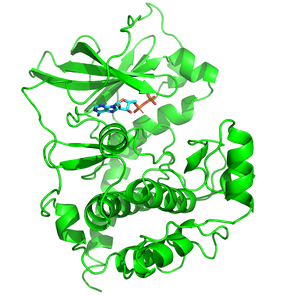
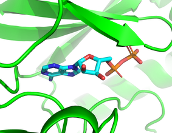
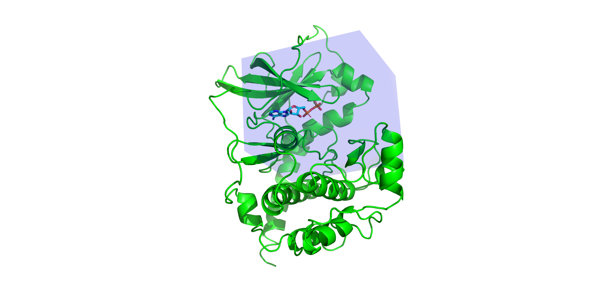
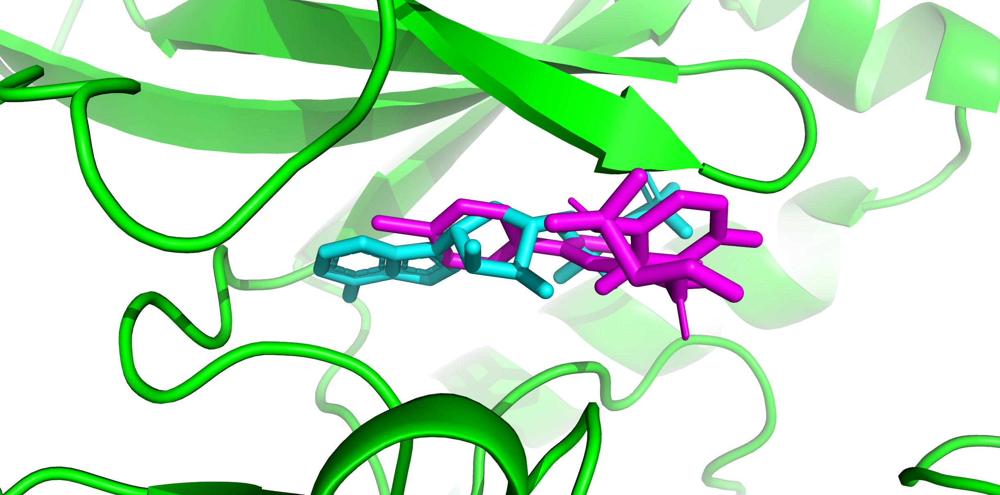

# VSvina

VSvina is a simple tool for [Virtual Screening](https://en.wikipedia.org/wiki/Virtual_screening) of a library of ligands against a protein receptor by docking them with [Autodock Vina](http://vina.scripps.edu/).

### Installation

Copy the contents of repository in a directory and add it to your `$PATH` variable

```sh
export PATH="<PATH TO VSvina>:$PATH"
```
You can add above line to your `.bashrc` file after replacing <PATH TO VSvina> with actual path of VSvina on your system.

Alternatively you can simple make alias to `VSparse.pl` and `VSvina.pl` by adding following line to `.bashrc`

```sh
alias VSvina.pl="<PATH TO VSvina>/VSvina.pl"
alias VSparse.pl="<PATH TO VSvina>/VSparse.pl"
```

### Usage

Invoke the programs with the `-h` or `--help`

#### `VSvina.pl`
```
VSvina.pl --help
```
```

__     ______       _             
\ \   / / ___|_   _(_)_ __   __ _
 \ \ / /\___ \ \ / / | '_ \ / _' |
  \ V /  ___) \ V /| | | | | (_| |
   \_/  |____/ \_/ |_|_| |_|\__._|
    Virtual Screening of Ligands                                  
    ©Narendra Kumar, 2020
    https://github.com/narekum/VSvina

Usage: VSvina.pl < -l <LIGAND_DIR> -r <RECEPTOR_PDBQT_FILE> -o <OUTPUT_DIR> -c <VINA_CONFIG_FILE>

Options:
  -h, --help       Print this help.
  -l, --liganddir  Directory containing pdbqt files of the ligands
  -r, --receptor   Receptor pdbqt file
  -o, --outdir     Output directory (will be created)
  -c, --conf       Autodock vina configuration file
  -m, --mapfile    Mapfile matching names of ligands to its pdbqt file
                   Mapfile is a tab delimited in the following format

                   NAME_OF_THE_LIGAND<TAB>FILE_NAME.pdbqt

Examples:
$ perl VSvina.pl --liganddir ./ligands --receptor receptor.pdbqt --outdir screeing_results --conf configuration.txt
\or\
$ perl VSvina.pl -l ./ligands -r receptor.pdbqt -o screeing_results -c configuration.txt

```

#### `VSparse.pl`
```
VSparse.pl --help
```
```
__     ______                            
\ \   / / ___| _ __   __ _ _ __ ___  ___
 \ \ / /\___ \| "_ \ / _" | "__/ __|/ _ \
  \ V /  ___) | |_) | (_| | |  \__ \  __/
   \_/  |____/| .__/ \__._|_|  |___/\___|
              |_|                        
    SDF parsing for Virtual Screening   

Usage: VSparse.pl -s drugbank.sdf

Options:

  -h, --help      Print this help
  -s, --sdf       Sdf input file.
  -f, --fields    comma separated list of fields to report in output
  -r, --report    reports the fields in the input sdf file

Examples:
$ perl VSparse.pl -s drugbank.sdf -r  
$ perl VSparse.pl -s drugbank.sdf -report  

$ perl VSparse.pl -s drugbank.sdf
$ perl VSparse.pl -s drugbank.sdf -f EXACT_MASS,INCHI_KEY

```

## VSvina tutorial

The steps here demonstrate how to dock a library of ligands to a receptor protein. The receptor used here is cAMP dependent protein kinase (PDB ID: [1JBP](https://www.rcsb.org/structure/1JBP)) also known as protein kinase A (PKA). PKA in this structure is in complex with Adenosine Diphosphate (ADP) and a substrate peptide. We will dock ligands in our library in place where ADP is originally bound in the structure.

### What you need
1. [VSvina](https://github.com/narekum/VSvina) - scripts for virtual screening
2. [Autodock Vina](http://vina.scripps.edu/) - docking engine
3. [Autodock tools](http://autodock.scripps.edu/resources/adt) - for preparing receptor for docking
4. [Openbabel](http://openbabel.org/wiki/Main_Page) - file format conversion
5. [Pymol](https://pymol.org/2/) - for visualising docked ligands

### Preparing the ligand library

We will screen following compounds against ADP binding pocket of PKA in PDB structure 1JBP.

1. Adenosine monophosphate (Drugbank ID DB00131)
2. Adenosine triphosphate (Drugbank ID DB00171)
3. Vemurafenib (Drugbank ID DB08881)
4. Imatinib (Drugbank ID DB000619)

Download 3D-SDF files of these compounds from [drugbank database](https://www.drugbank.ca/) and concatenate them in a single file. The file `ligands.sdf` in test folder has these compounds in 3D-SDF format

These compounds are only for demonstration. Any number of ligands in 3D-SDF format may be used to prepare ligand library e.g. FDA approved drugs obtained from drugbank.

Create a directory `PKA_screening` for the Virtual Screening Project. We will keep all the input and result files in this directory. Change to this directory and copy ligands.sdf here.
```sh
mkdir PKA_screening
cd PKA_screening
cp <VSvinapath>/VSvina/test/ligands.sdf .
# replace VSvinapath with VSvina's installation path on the local machine
```
Autodock vina needs individual ligands in pdbqt format for docking with receptor. We will convert the ligands in ligands.sdf to pdbqt format and store them in a separate folder which will serve as a ligand library folder.   

Create a directory `ligands` within `PKA_screening` which will keep all the ligands in pdbqt format extracted from ligands.sdf.

```sh
mkdir ligands
```
Extract individual ligands to `ligands` directory after converting from 3D-SDF format to pdbqt format.

```sh
obabel -isdf ligands.sdf -opdbqt -O ligands/structures.pdbqt -m
```  
This would create structures1.pdbqt, structures2.pdbqt, structures3.pdbqt and structures4.pdbqt in `ligands` directory. We have our ligand molecules ready for docking. We just need to associate the ligands files with their IDs and names. This information in a file is needed for virtual screening. VSparse could be used to prepare this file.

```sh
VSparse.pl -s ligands.sdf -f DATABASE_ID,JCHEM_TRADITIONAL_IUPAC > ligand_list.txt
```
```sh
cat ligand_list.txt
```
```txt
structures1.pdbqt   DB00131 adenylate
structures2.pdbqt   DB00171 adenosine triphosphate
structures3.pdbqt   DB08881 vemurafenib
structures4.pdbqt   DB00619 imatinib
```
VSvina needs this file. It could be created by any means. First column should be the ligand file names in ligands library (directory). Second column is the IDs of the ligands and third column is the name of the ligand. First three column are required. Second and third column are reported by `-f` flag with DATABASE_ID and JCHEM_TRADITIONAL_IUPAC which are tags in SDF. Any additional information can be added by providing corresponding tags in input SDF file. A list of available tags could be obtained by `VSparse.pl -s ligands.sdf -r` command.

### Preparing receptor for docking

For docking the ligands to receptor, receptor pdb file must be converted to pdbqt file. Our receptor is PKA from which the ligand ADP has been removed. We want to dock ligands from our library in the same place where ADP was originally bound.

|PKA (1JBP)|ADP bound to PKA|
|--------------:|:--------------:|
||

Copy 1jbp.pdb from test directory to current directory

```sh
cp <VSvinapath>/VSvina/test/ligands.sdf .
```
Open 1JBP with autodock tools

```sh
adt 1jbp.pdb
```
**Add polar hydrogen:** Edit -> Hydrogen -> Add -> Polar only

**Select area for docking:** Grid -> Grid Box

Set spacing to 1 angstroms

Choose x center, y center and z center value

Choose number of points in x,y and z direction ( by rotating dials )

Choose offset ( by rotating dials)

The chosen values define an area where ligands would be docked. The area outside the box will not be explored.



Save the chosen values in conf.txt file
```txt
center_x =  17.267
center_y =  6.986
center_z =  5.437

size_x = 28
size_y = 22
size_z = 26

exhaustiveness = 8
```

**Save the molecule in a pdbqt file:** Grid -> Macromolecules -> Choose -> 1jbp -> save 1jbp.pdbqt

### Virtual Screening with VSvina

VSvina will use autodock vina to dock one ligand at a time from the ligand library to chosen area in PKA.

Run the following command

```sh
VSvina.pl -l ./ligands -r 1jbp.pdbqt -o PKA_screening_results -c conf.txt -m ligands_list.txt
```
After VSvina completing the run, VSvina writes the results to `PKA_screening_results` directory. Docked ligands are in PKA_screening_results/results directory. The list of ligands sorted by their binding energies is in `PKA_screening_results/1jbp.pdbqt_docking_results.txt` file

```sh
cat PKA_screening_results/1jbp.pdbqt_docking_results.txt
```

```txt
        mode |   affinity | dist from best mode
             | (kcal/mol) | rmsd l.b.| rmsd u.b.
        -----+------------+----------+----------
DB08881   1         -9.4      0.000      0.000	vemurafenib
DB00619   1         -9.3      0.000      0.000	imatinib
DB00171   1         -8.3      0.000      0.000	adenosine	triphosphate
DB00131   1         -8.2      0.000      0.000	adenylate

```
Evidently `vemurafenib` is top affinity binder to ATP among the four ligands in our library


Origina ADP is in cyan while best docked conformation of vemurafenib is in magenta.  
